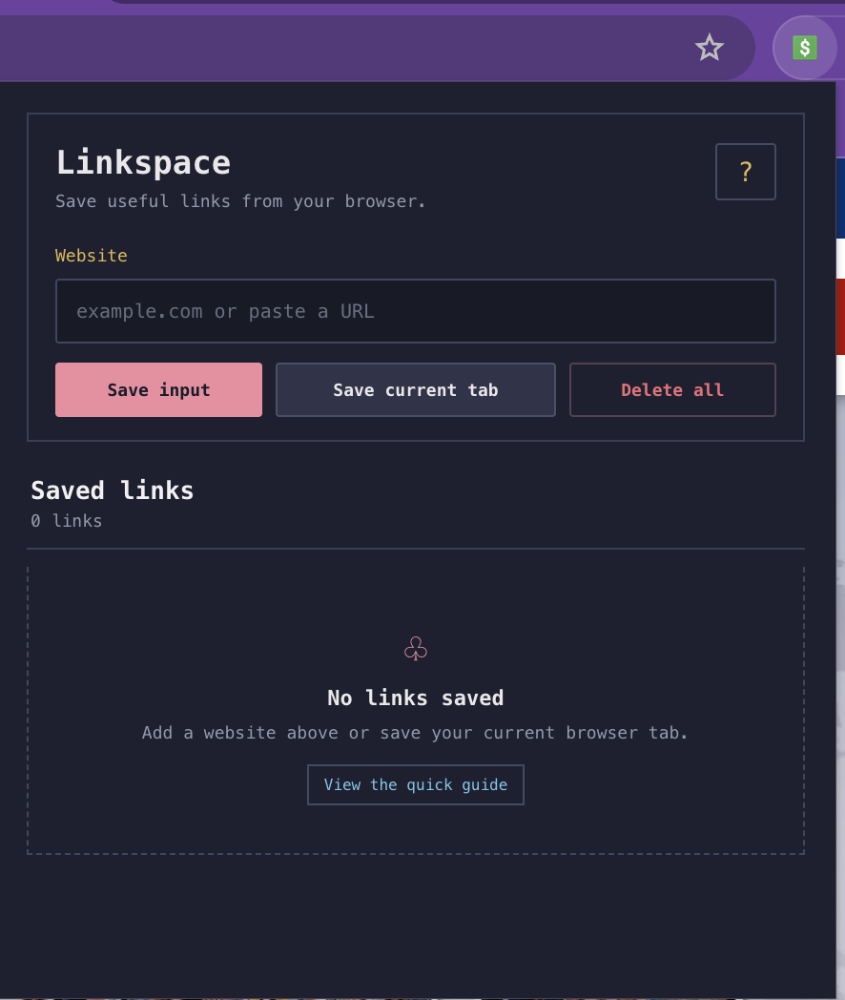
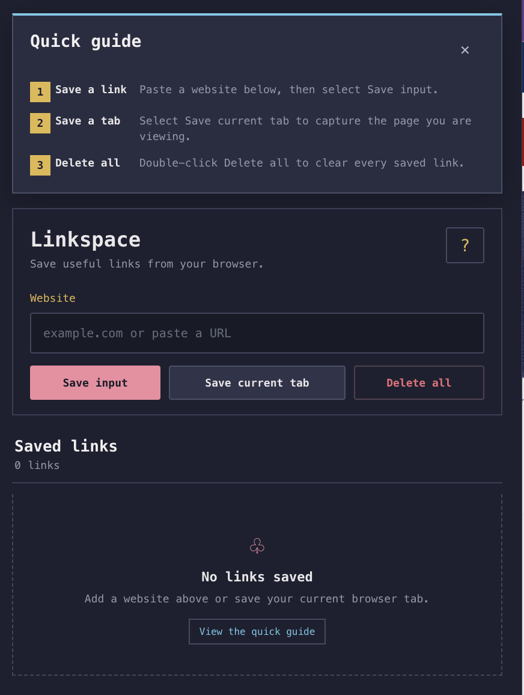
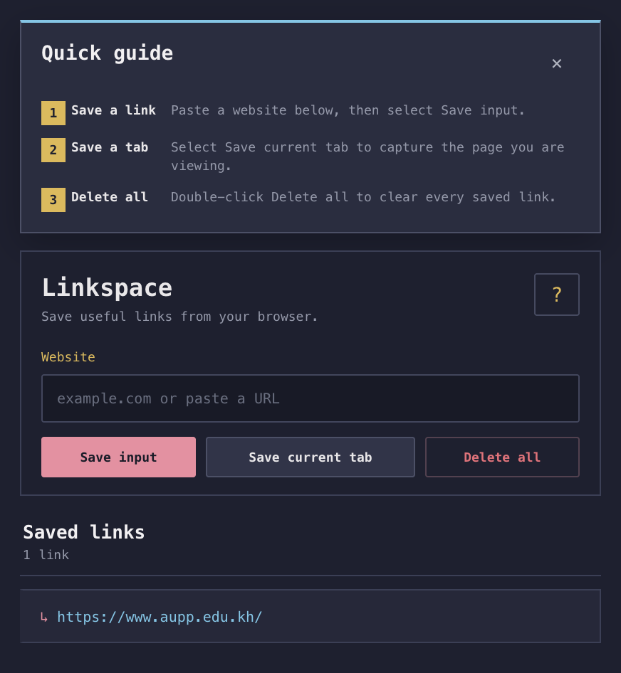

# Linkspace

Linkspace is a Manifest V3 Chrome extension for capturing and organizing useful websites in a focused, developer-inspired workspace.

## Preview

### Main interface

### Built-in quick guide

### Saved link

## Features

- Save a website entered manually
- Save the active Chrome tab
- Open saved links in a new tab
- Delete every saved link with a double-click
- Read the built-in quick guide
- Store links locally in the browser

## Load in Chrome

1. Open `chrome://extensions`.
2. Enable **Developer mode**.
3. Select **Load unpacked**.
4. Choose this project directory.

After editing the source, use the reload button on the extension card before testing again.

## How to use Linkspace

### Save a website manually

1. Select the Linkspace icon in the Chrome toolbar.
2. Enter or paste a website address into the **Website** field.
3. Select **Save input**.
4. The website will appear under **Saved links**.

You can select any saved link to open it in a new browser tab.

### Save the current browser tab

1. Open the website you want to save.
2. Open Linkspace from the Chrome toolbar.
3. Select **Save current tab**.

Linkspace saves the address of the active tab automatically.

### Delete saved links

Double-click **Delete all** to remove every saved link. A double-click is required to help prevent accidental deletion.

### Open the quick guide

Select the **?** button in the upper-right corner of Linkspace. Select the **×** button to close the guide.

## Project structure

- `manifest.json` — extension metadata and permissions
- `index.html` — accessible popup structure
- `index.css` — popup design system and components
- `index.js` — extension behavior, organized into clearly labeled sections
- `icon.png` — extension icon
- `images/` — screenshots used in this README

All user-provided text is rendered through DOM text nodes rather than HTML strings.
